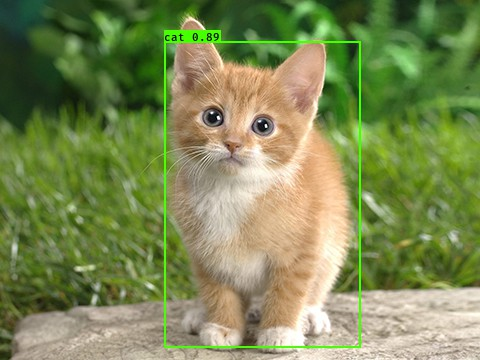

# YOLO-Pytorch
[中文说明](README.zh.md)

## Description

This is a pytorch version of [YAD2K](https://github.com/allanzelener/YAD2K)。

Original paper: [YOLO9000: Better, Faster, Stronger](https://arxiv.org/abs/1612.08242)by Joseph Redmond and Ali Farhadi.

<p align="center"></p>

---

## Requirements

- Pytorch 0.3.0
- torchvision
- opencv（Requirement for camera and video）
- python 3


## Usage

1. Download Darknet model cfg and weights from the [official YOLO website](http://pjreddie.com/darknet/yolo/).

   ```bash
   # for example --- or other version cfg and weights
   wget http://pjreddie.com/media/files/yolo.weights
   wget https://raw.githubusercontent.com/pjreddie/darknet/master/cfg/yolo.cfg
   ```
   Note: you can download other types: like `yolo-voc.cfg`

2. Convert the weights to `.pth`

   ```bash
   python tools/yad2t.py path-to-yolo-cfg path-to-yolo-weights path-to-output-folder
   ```

   Note:  default choose

   - copy your `yolo.cfg` and `yolo.weights` to the directory `config`
   - the output folder is `model`

3. Three demos (picture, camera, video)

   1. `demo.py`

      ```bash
      python demo.py pic-path yolo-type --cuda=True
      ```

      Note: default choose

      - picture in folder `results/demo`
      - `yolo-type` is `yolo`： three kinds: `[yolo, tiny-yolo-voc, yolo-voc]`

   2. `demo_cam.py`

      ```bash
      python demo_cam.py --trained_model=pth_model_from_1
      ```

   3. `demo_video.py`

      ```bash
      python demo_video.py --demo_path=video_path --trained_model=pth_model_from_1
      ```


